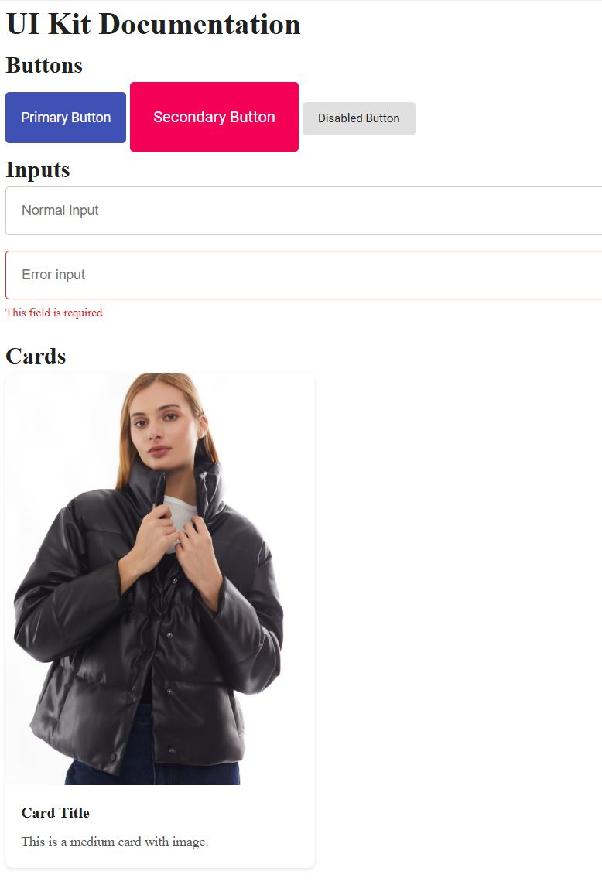

# UI Kit - Библиотека компонентов



## 📋 Описание проекта

Библиотека компонентов пользовательского интерфейса, созданная с использованием:
- Методологии БЭМ
- Адаптивного дизайна (mobile-first)
- Современных CSS-технологий (Flexbox, Grid)

## 🛠 Технологии

| Технология | Назначение |
|------------|------------|
| HTML5 | Разметка компонентов |
| SCSS (Sass) | Стилизация с модулями |
| Flexbox/Grid | Построение макетов |
| БЭМ | Организация CSS-классов |


## 🗂 Структура проекта

```
ui-kit/
├── index.html                  # Документация компонентов
├── styles/
│   ├── base/                   # Базовые стили
│   │   ├── _reset.scss         # Сброс стилей
│   │   ├── _variables.scss     # Переменные
│   │   └── _base.scss          # Базовые элементы
│   ├── components/             # Компоненты
│   │   ├── _buttons.scss       # Кнопки
│   │   ├── _inputs.scss        # Поля ввода
│   │   ├── _cards.scss         # Карточки
│   │   └── _navbar.scss        # Навигация
│   ├── layouts/                # Макеты
│   │   ├── _containers.scss    # Контейнеры
│   │   └── _grids.scss         # Сетки
│   └── main.scss               # Главный SCSS-файл
├── assets/
│   ├── images/                 # Изображения
│   └── icons/                  # Иконки
└── README.md                   # Документация
```

## 🧩 Компоненты

### 🎛 Кнопки (`buttons`)
```html
<!-- Primary кнопка -->
<button class="button button--primary button--medium">
  Нажми меня
</button>

<!-- Disabled состояние -->
<button class="button button--primary button--large" disabled>
  Неактивно
</button>


📝 Поля ввода (inputs)


<div class="input__container">
  <input type="text" class="input__field" placeholder="Введите имя">
</div>

<!-- Поле с ошибкой -->
<div class="input__container">
  <input type="email" class="input__field input__field--error">
  <span class="input__error">Неверный email</span>
</div>


🖼 Карточки (cards)

<div class="card card--medium">
  
  <div class="card__content">
    <h3 class="card__title">Название товара</h3>
    <p class="card__text">Описание товара</p>
  </div>
</div>


🧭 Навигация (navbar)

<nav class="navbar">
  <div class="navbar__logo">Логотип</div>
  <button class="navbar__hamburger">☰</button>
  <ul class="navbar__items">
    <li class="navbar__item"><a href="#">Главная</a></li>
    <li class="navbar__item"><a href="#">О нас</a></li>
  </ul>
</nav>


🚀 Установка
Клонировать репозиторий:

git clone https://github.com/ваш-username/ui-kit.git
cd ui-kit


Установить зависимости:

npm install -g sass


Компиляция SCSS:

sass styles/main.scss styles/main.css --no-source-map


Запустить документацию:

open index.html  # На Mac
start index.html # На Windows


⚙️ Кастомизация
Отредактируйте файл styles/base/_variables.scss:

// Цветовая схема
$primary-color: #3f51b5;    // Основной цвет
$secondary-color: #f50057;  // Акцентный цвет
$error-color: #d32f2f;      // Цвет ошибок

// Типографика
$font-family: 'Roboto', sans-serif;
$font-size-small: 0.75rem;  // 12px


📜 Лицензия
MIT License. Подробнее в файле LICENSE.
